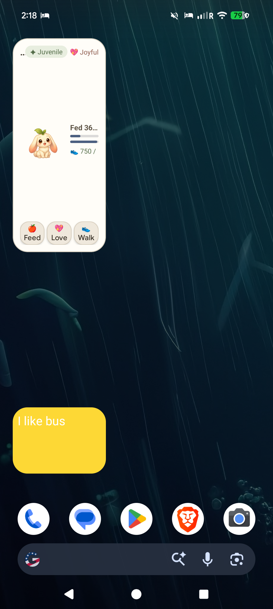
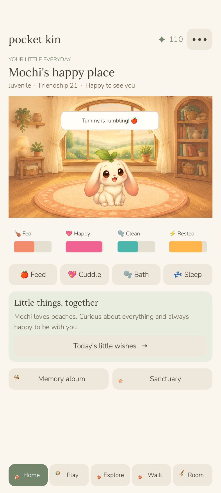
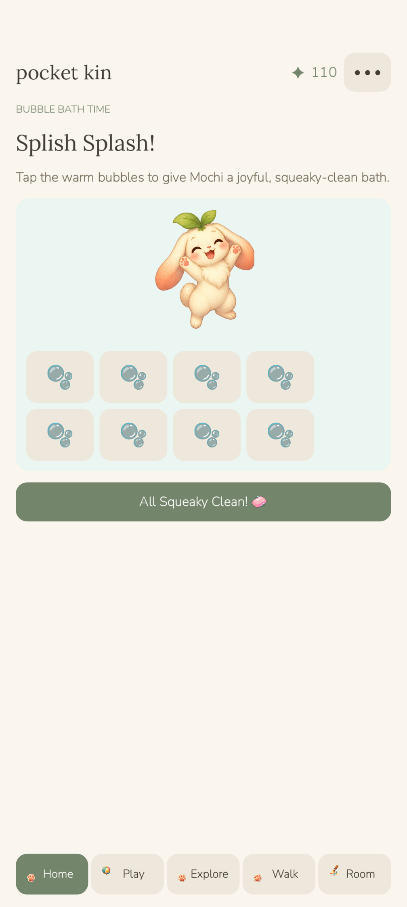
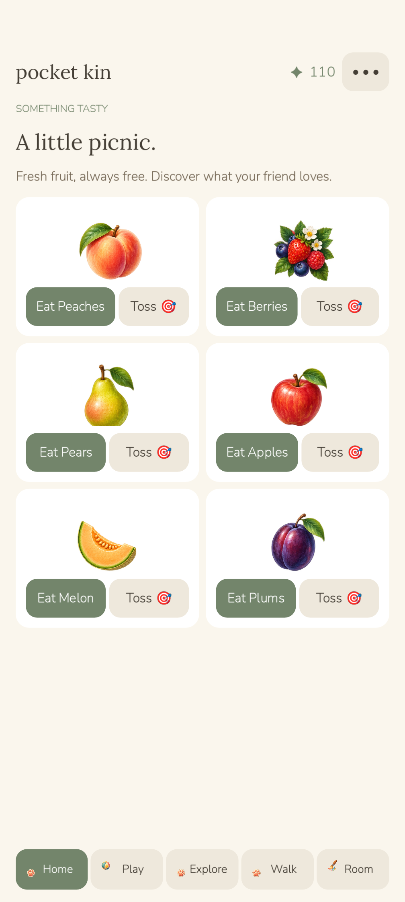
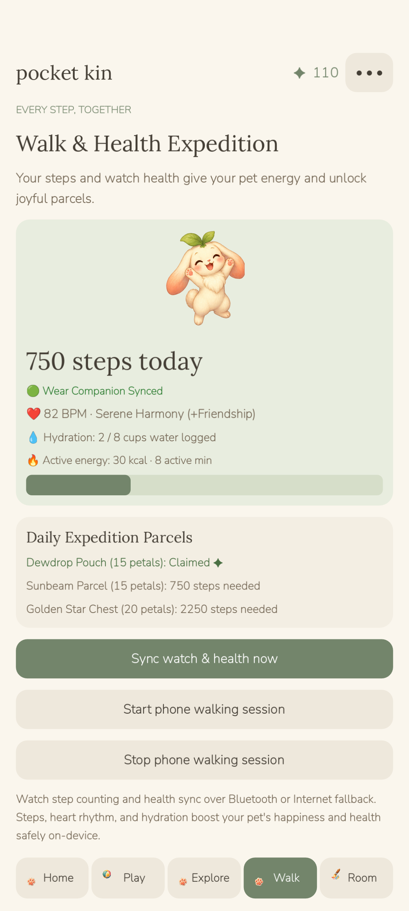
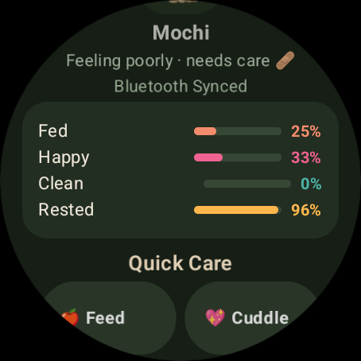
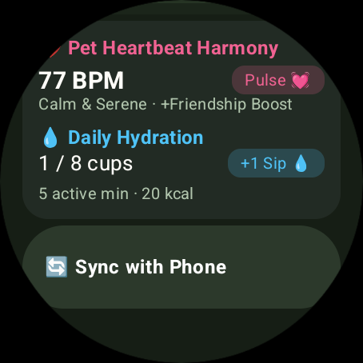
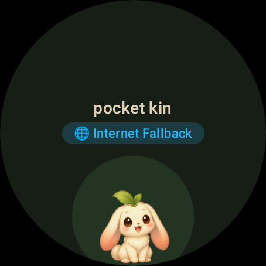
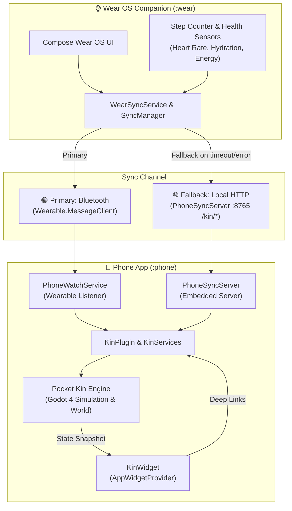

# Pocket Kin 🐾

A cozy storybook virtual-pet game for Android with original hand-crafted artwork, egg hatching, care and growth, interactive petting, bubble baths, treat tossing, mini-games, exploration, room decoration, walking rewards, home-screen widget, and a connected **Wear OS companion app** featuring live step tracking and health monitoring.

---

## ✨ Features

- **Cozy Storybook Aesthetics**: Warm, hand-crafted watercolor visual design featuring 6 unique pet species across baby, juvenile, and adult stages.
- **Interactive Pet Care**:
  - **Petting**: Gentle swipe gestures over your pet trigger sparkling heart particle fountains and purring audio, building your friendship bond.
  - **Splish-Splash Bubble Bath**: Interactive soap bubbles (`🫧`) that pop into sparkling hearts (`💖`) on tap with realistic audio and haptic feedback.
  - **Fruit Picnic & Treat Tossing**: Discover your pet's favorite fruits and toss treats (`🎯`) for joyful reaction catches.
  - **Illness & Recovery**: Soothing treatments to heal your friend when unwell.
- **⌚ Wear OS Companion App**:
  - **Dual-Channel Synchronization**: Primary sync via Google Play Services Wearable API (`Wearable.MessageClient`) with automatic real-time fallback to local HTTP (`PhoneSyncServer`).
  - **Step Tracking**: Live hardware step counter counts toward daily expedition parcel unlocks (Dewdrop Pouch, Sunbeam Parcel, Golden Star Chest).
  - **Pet Heartbeat Harmony**: Monitors heart rate (BPM) and rewards calm rhythms with pet friendship bonuses.
  - **Daily Hydration**: One-tap water logging (`+1 Sip 💧`) to refresh pet vitality.
  - **Quick Care from Wrist**: Feed, Cuddle, Wash, Bed, and Raindrop Rhythm minigame.
  - **Wear OS Tiles & Complications**: Glanceable pet mood and steps directly on your watch face.
- **🖼️ Interactive Home-Screen Widget**:
  - Live stage badge, mood status, Hunger and Happiness progress bars, and synced step counters.
  - Quick-action buttons (`🍎 Feed`, `💖 Love`, `👟 Walk`) with cold-start intent routing directly into the game.
- **Cloud Saves & Firebase**: Local-first architecture with external cloud snapshots and safe conflict resolution.

---

## 📸 Screenshots

| Home Screen Widget | Pet Sanctuary | Interactive Bubble Bath |
| :---: | :---: | :---: |
|  |  |  |

| Fruit Picnic | Walk & Health Expedition | Wear OS Companion |
| :---: | :---: | :---: |
|  |  |  |

| Wear Health & Harmony | Wear Live Sync |
| :---: | :---: |
|  |  |

---

## 🏗️ Architecture



---

## 🚀 Building & Testing

### Prerequisites
- Android SDK 34+
- Java 17+
- Godot 4.3+ / 4.7+
- Gradle 8.13

### Build Phone & Wear APKs
```powershell
# Export Godot PCK
./tools/godot/Godot_v4.7.2-stable_win64_console.exe --headless --path game --export-pack Pack ../artifacts/pocket-kin.pck
Copy-Item artifacts/pocket-kin.pck android/phone/src/main/assets/pocket-kin.pck

# Build Debug APKs
./tools/gradle-8.13/bin/gradle.bat -p android :phone:assembleDebug :wear:assembleDebug
```

### Install to Devices
```powershell
# Install on Pixel phone
adb -s <phone_device_id> install -r android/phone/build/outputs/apk/debug/phone-debug.apk

# Install on Wear OS watch / emulator
adb -s <watch_device_id> install -r android/wear/build/outputs/apk/debug/wear-debug.apk
```

---

## 📄 License

Original project code and storybook assets created for Pocket Kin. All rights reserved.
